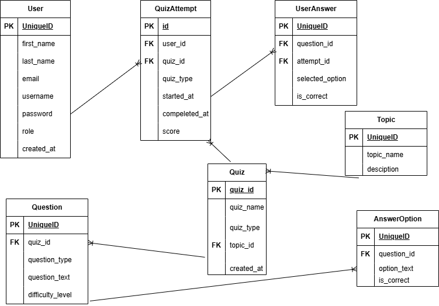

# MedLoveScience Quiz Application (Backend Service)

MedLoveScience is a quiz-based learning platform tailored for Medical Laboratory Science (MLS) students. It helps learners strengthen their theoretical knowledge and prepare for exams through topic-focused quizzes, case-based questions, and image-based laboratory scenarios.

## Features
* **User System:** Secure registration and authentication system to manage student accounts and track progress.
* **Quiz Creation:** Admins can create quizzes with multiple types of questions including multiple-choice, case-based, and image-based questions.
* **Result Display:** Immediate feedback and detailed results after quiz completion.
* **Timer:** Optional timer for quizzes to simulate exam conditions.
* **Auto Scoring:** Automatic grading of submitted quizzes for instant results.
* **Explanation for Answers:**  Detailed explanations for each question to enhance learning and understanding.

## Technologies Stack
* **Django** – Backend web framework
* **Django REST Framework (DRF)** – For building RESTful APIs
* **Token-based Authentication** – Secure user authentication
* **PostgreSQL** – Relational database for reliable data storage
* **Swagger** (via drf-yasg) – Interactive API documentation

